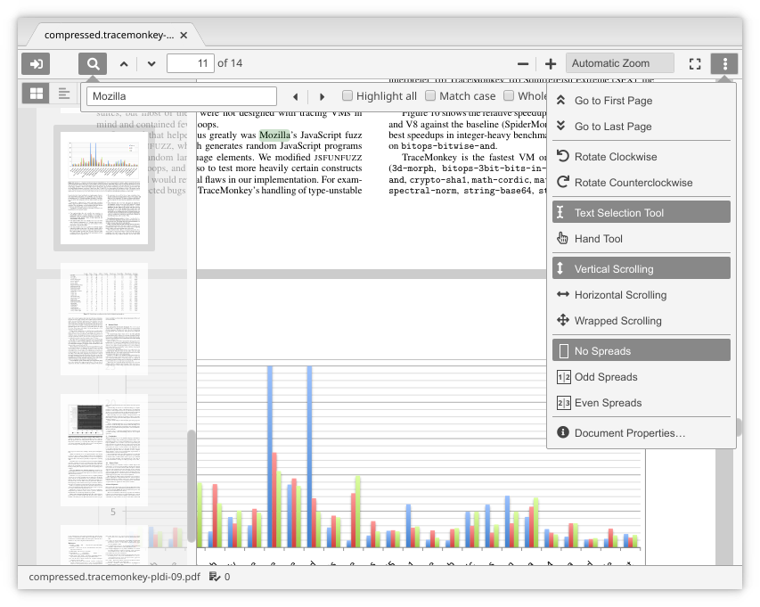

# pdfjs-viewer

pdfjs-viewer is a package for the [Atom editor](https://atom.io/) that makes it possible to view PDF files in Atom panes. It is a wrapper around Mozilla's [PDF.js](https://github.com/mozilla/pdf.js) library including its viewer application, adapted for the Atom environment.

pdfjs-viewer has the same purpose as the [pdf-view](https://atom.io/packages/pdf-view) and [pdf-view-plus](https://atom.io/packages/pdf-view-plus) packages, but differs in several respects:

-   Other than pdf-view, this package features the full viewer UI, including

    -   outline / thumbnail / attachments view,
    -   text search,
    -   zoom levels,
    -   fullscreen mode,
    -   rotation,
    -   text selection and copy, and
    -   annotations.

-   Other than pdf-view-plus, the viewer has been reskinned in compliance with the [request](https://mozilla.github.io/pdf.js/getting_started/) of PDF.js developers not to use it unmodified. UI elements blend in with the current Atom theme. Some elements have been removed because they serve no function within Atom, and some keyboard shortcuts have been removed because they interfere with Atom's. Almost all icons have been replaced with alternatives from [Font Awesome](https://fontawesome.com/).

PDF files can be opened from the Atom user interface, e.g. from the project tree view, or programmatically through `atom.workspace.open()`. The package watches for file changes and reloads the PDF. Viewer panes are persistent across Atom runs.

internal keyboard shorcuts

---

This software is copyrighted © 2020 by Carsten Allefeld and released under the terms of the MIT license, except for the included modified copy of the [PDF.js](https://github.com/mozilla/pdf.js) library and viewer (pre-built release [pdfjs-2.3.200-dist](https://github.com/mozilla/pdfjs-dist/releases/tag/v2.3.200)), © Mozilla and individual contributors and released under the terms of the Apache-2.0 license.
